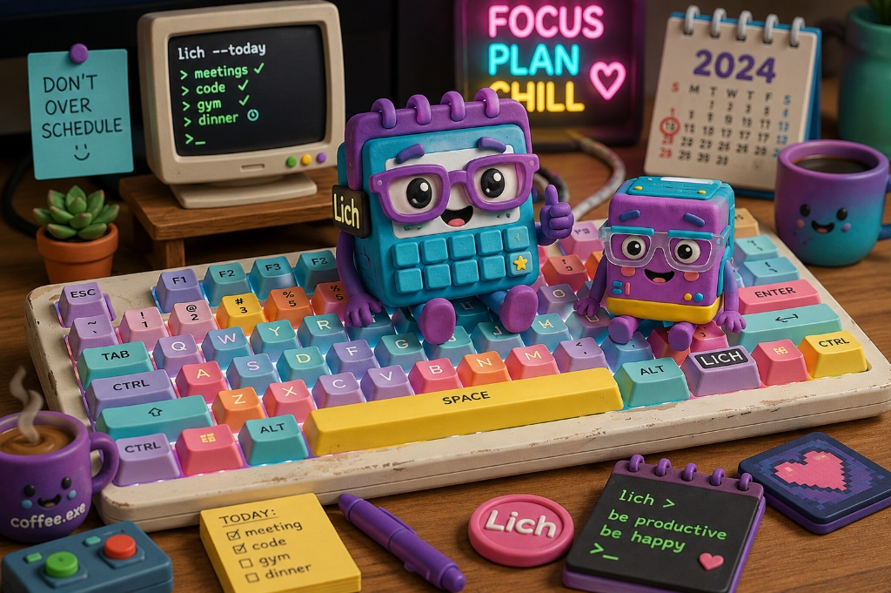

# Mỹ Lích — Lịch của mình, mình tính

<p align="center">
  
</p>

> **Một cái lịch vui vẻ, siêu tốc, local-first cho Terminal (CLI/TUI) và tự host backend riêng tư.**

**Mỹ Lích** là hệ thống lịch cá nhân **local-first**, cho phép bạn quản lý lịch bằng terminal thông qua CLI/TUI, tự lưu trữ dữ liệu bằng `lich-server`, và đồng bộ với các dịch vụ bên ngoài như Google Calendar.

Tên là **Mỹ Lích**.

Lệnh là **`lich`**.

Không có lý do gì cả. Đừng hỏi. 🚀

---

## Có gì trong đây?

```text
                         Mỹ Lích
                            │
              ┌─────────────┴─────────────┐
              │                           │
          lich-cli                   lich-server
          Go + Charm                 Node.js + Fastify
              │                           │
       ┌──────┴──────┐                    │
       │             │                    │
      CLI            TUI                SQLite
       │             │                    │
       └──────┬──────┘                    │
              │                           │
         Local-first                      │
         Local cache                      │
              │                           │
              └──────── REST API ─────────┘
                            │
                            ▼
                    Google Calendar
                    Notifications
                    Webhooks
                    ...
```

### `lich-cli`

CLI + TUI viết bằng Go, dùng [Bubble Tea & Lip Gloss](https://charm.sh/).

```bash
lich add "Họp nhóm" --at 10:00
lich today
lich week
lich sync -w
lich google status
```

### `lich-server`

Backend tự host, viết bằng Node.js + Fastify + TypeScript + SQLite.

Chịu trách nhiệm:
- Lưu trữ calendars và events
- Authentication (JWT, Multi-tenant)
- Incremental sync engine & changelog cursor
- Tích hợp 2 chiều Google Calendar
- Webhooks & Notifications

---

# Triết lý

## Local-first

Internet chậm không phải lỗi của cái lịch.

Khi bạn chạy:

```bash
lich add "Ăn tối với người yêu" --at 19:00
```

`lich` không ngồi đó:

```text
"Đợi tí để tôi gọi server..."
"Đợi tí để tôi gọi Google..."
"Đợi tí mạng hơi lag..."
```

Thay vào đó:

```text
Bạn
 │
 ▼
lich
 │
 ├── Lưu local cache (SQLite) ✓ (Phản hồi tức thì)
 ├── Hiển thị giao diện      ✓
 └── Sync ngầm với Server    ↻ (Tự động retry khi có mạng)
```

Mất mạng vẫn dùng được. Mạng quay lại thì tự sync.

---

# Bắt đầu nhanh

## 1. Khởi động `lich-server`

### Cách 1: Chạy bằng Docker / Docker Compose (Khuyên dùng)

Chỉ cần chạy lệnh từ thư mục gốc của dự án:

```bash
docker compose up -d
```

Hoặc kéo trực tiếp pre-built container image từ GitHub Container Registry:

```bash
docker run -d \
  --name lich-server \
  -p 3000:3000 \
  -v lich-data:/data \
  -e JWT_SECRET=your-secure-secret \
  ghcr.io/spiderdev-vn/mylich-server:latest
```

### Cách 2: Chạy trực tiếp với Node.js / Yarn

```bash
cd lich-server
yarn install
yarn dev
```

Server mặc định chạy tại `http://127.0.0.1:3000` (hoặc `0.0.0.0:3000` khi chạy trong Docker).

Kiểm tra trạng thái:
```bash
curl http://127.0.0.1:3000/health
```

---

## 2. Cài đặt và chạy `lich-cli`

Build và ký Authenticode (Windows):
```powershell
.\build-and-sign.cmd
```

Chạy binary đã build:
```powershell
.\bin\lich.exe
```

Hoặc chạy trực tiếp qua Go:
```bash
cd lich-cli
go run ./cmd/lich
```

---

# Hướng dẫn sử dụng CLI

## Đăng nhập & Tài khoản

Đăng ký hoặc đăng nhập tương tác:
```bash
lich login
```

Đăng nhập qua cờ CLI:
```bash
lich login --username alice --password password123
```

Kiểm tra trạng thái máy chủ, local database & sync queue:
```bash
lich status
lich status --simple
```

---

## Quản lý cấu hình (`config`)

Xem và chỉnh sửa cấu hình client:
```bash
lich config
lich config icons nerd       # unicode | nerd | ascii | emoji
lich config agenda gantt     # gantt | list
```

---

## Thêm sự kiện (`add`)

Mở form tương tác TUI (nếu không truyền tham số):
```bash
lich add
```

Thêm nhanh bằng tham số dòng lệnh:
```bash
# Giờ bắt đầu mặc định thời lượng 1 tiếng
lich add "Họp nhóm" --at 10:00

# Chỉ định cả giờ bắt đầu và kết thúc
lich add "Làm việc tại quán cafe" --at 10:00 --to 12:30

# Sự kiện qua đêm (tự động tính sang ngày hôm sau)
lich add "Trực ca đêm" --at 22:00 --to 03:00

# Chỉ định thời lượng
lich add "Tập gym" --at 17:30 --duration 1h30m

# Ngày tương đối (today, tomorrow) hoặc YYYY-MM-DD
lich add "Khám nha khoa" --date tomorrow --at 2:30pm --to 3:15pm

# Đầy đủ địa điểm và mô tả
lich add "Gặp đối tác" --at 14:00 --to 15:30 --location "Quận 1" --desc "Ký kết hợp đồng"
```

---

## Xem lịch trình (`today`, `week`, `month`, `search`)

```bash
lich today             # Lịch hôm nay (Gantt chart hoặc List)
lich week              # Lịch 7 ngày trong tuần
lich month             # Lịch toàn bộ tháng hiện tại
lich search "nha khoa" # Tìm kiếm sự kiện theo từ khóa

# Xuất dữ liệu cho scripts / CI
lich today --simple    # ASCII plain text
lich today --json      # JSON output
```

---

## Chỉnh sửa & Xóa sự kiện (`edit`, `delete`, `nuke`)

```bash
# Chỉnh sửa sự kiện (chọn từ danh sách hoặc truyền ID)
lich edit
lich edit <event_id> --title "Tiêu đề mới" --at 14:00 --to 16:00

# Xóa sự kiện
lich delete
lich delete <event_id> --force

# Xóa sạch toàn bộ dữ liệu SQLite cache cục bộ (yêu cầu xác nhận an toàn)
lich nuke-database

# Xóa sạch toàn bộ dữ liệu cả trên MÁY CHỦ và CỤC BỘ (yêu cầu xác nhận an toàn)
lich nuke-database --remote
```

---

## Đồng bộ hóa (`sync`)

Hỗ trợ đồng bộ hóa 2 chiều hoặc có định hướng:

```bash
# Đồng bộ 2 chiều (Push & Pull)
lich sync

# Đồng bộ có live progress bar và chi tiết từng thao tác
lich sync -w

# Chỉ đẩy thay đổi cục bộ lên server
lich sync push -w

# Chỉ kéo thay đổi mới từ server về local cache
lich sync pull -w
```

---

# Tích hợp Google Calendar (`google`)

Google Calendar hoạt động như một integration vệ tinh kết nối với `lich-server`, trong đó dữ liệu của Mỹ Lích là **Source of Truth** (nguồn chân lý).

```text
                 Mỹ Lích (Source of Truth)
                            │
               ┌────────────┴────────────┐
               ▼                         ▼
         Local SQLite               lich-server
                                         │
                                         ▼
                                  Google Calendar
```

---

## 🛠 Hướng dẫn thiết lập Google Cloud OAuth 2.0

Để kết nối với tài khoản Google thật, bạn cần tạo OAuth 2.0 Credentials trên Google Cloud Console:

### Bước 1: Tạo Project & Bật Google Calendar API
1. Truy cập [Google Cloud Console](https://console.cloud.google.com/) và tạo một Project mới.
2. Vào **APIs & Services** $\rightarrow$ **Library**, tìm kiếm **Google Calendar API** và nhấn **Enable** (Bật).

### Bước 2: Cấu hình OAuth Consent Screen
1. Vào **APIs & Services** $\rightarrow$ **OAuth consent screen**.
2. Chọn loại **External** (hoặc Internal nếu dùng Google Workspace).
3. Nhập tên ứng dụng (ví dụ: `My Lich Calendar`) và email hỗ trợ.
4. Ở mục **Scopes**, thêm scope:
   - `https://www.googleapis.com/auth/calendar` (Toàn quyền đọc/ghi/tạo Lịch và Sự kiện)
   - `https://www.googleapis.com/auth/userinfo.email` (Nhận diện email)
5. Ở mục **Test users**, thêm địa chỉ Gmail của bạn để cho phép đăng nhập thử nghiệm.

### Bước 3: Tạo OAuth Client ID
1. Vào **APIs & Services** $\rightarrow$ **Credentials** $\rightarrow$ **Create Credentials** $\rightarrow$ **OAuth client ID**.
2. Chọn **Application type**: `Web application`.
3. Tên: `Lich Server Client`.
4. Tại mục **Authorized redirect URIs**, thêm chính xác URL sau:
   ```text
   http://127.0.0.1:3000/auth/google/callback
   ```
5. Nhấn **Create** và sao chép **Client ID** cùng **Client Secret**.

### Bước 4: Cấu hình biến môi trường trên `lich-server`
Mở terminal hoặc tạo file `.env` trong thư mục `lich-server/`:

```bash
GOOGLE_CLIENT_ID="123456789-xxxxxxxx.apps.googleusercontent.com"
GOOGLE_CLIENT_SECRET="GOCSPX-xxxxxxxxxxxxxxxx"
GOOGLE_REDIRECT_URI="http://127.0.0.1:3000/auth/google/callback"
```

> **Ghi chú**: Nếu bạn không thiết lập các biến môi trường trên, `lich-server` sẽ tự động chuyển sang chế độ **FakeGoogleProvider** để bạn thử nghiệm toàn bộ luồng OAuth, map lịch và sync hoàn toàn offline mà không cần tài khoản Google thật.

---

## 📅 Quản lý Lịch & Tự động tạo trên Google Calendar (`calendar`)

Bạn có thể tạo các lịch riêng biệt (ví dụ: Công việc, Cá nhân, Thể thao) trực tiếp từ CLI và đồng bộ lên Google:

```bash
# 1. Xem danh sách tất cả các lịch và trạng thái map Google
lich calendar list

# 2. Tạo lịch mới và TỰ ĐỘNG TẠO LỊCH MỚI TRÊN GOOGLE CALENDAR + map 2 chiều:
lich calendar add "Công Việc" --timezone Asia/Ho_Chi_Minh --sync-google

# 3. Tạo lịch chỉ trong Lich (không tạo trên Google):
lich calendar add "Dự Án Cá Nhân"

# 4. Liên kết một lịch Lich có sẵn với Google (tạo lịch mới trên Google):
lich google create-calendar <lich_calendar_id> --name "Dự Án Cá Nhân"

# 5. Xóa lịch
lich calendar delete <lich_calendar_id>
```

---

## 💻 Các lệnh CLI điều khiển Google Calendar

### 1. Kết nối tài khoản Google (`connect`)
```bash
lich google connect
```
*Lệnh sẽ tự động mở trình duyệt web đến trang đăng nhập Google. Sau khi cấp quyền thành công, trình duyệt sẽ thông báo xác thực hoàn tất.*

### 2. Kiểm tra trạng thái liên kết (`status`)
```bash
lich google status
```
*Hiển thị trạng thái kết nối, email tài khoản Google và danh sách các lịch đang được liên kết.*

### 3. Xem danh sách lịch Google Calendar (`calendars`)
```bash
lich google calendars
```
*Liệt kê tất cả các lịch Google của bạn (kèm ID và múi giờ) để bạn chọn ánh xạ.*

### 4. Ánh xạ lịch Lich với Google Calendar (`map`)
```bash
# Cú pháp: lich google map <lich_calendar_id> <google_calendar_id> [sync_direction]
lich google map cal-default primary bidirectional
```
- `<lich_calendar_id>`: ID lịch trong Lich (lấy qua `lich calendar list` hoặc `lich google status`).
- `<google_calendar_id>`: ID lịch Google (ví dụ: `primary` hoặc `ten_lich@group.calendar.google.com`).
- `[sync_direction]`: Hướng đồng bộ: `bidirectional` (2 chiều), `push` (chỉ đẩy lên), hoặc `pull` (chỉ kéo về).

### 5. Tạo lịch mới trên Google cho một lịch Lich (`create-calendar`)
```bash
lich google create-calendar <lich_calendar_id> --name "Tên Lịch Trên Google"
```

### 6. Đồng bộ hóa với Google Calendar (`sync`)
```bash
# Đồng bộ hóa 2 chiều theo thiết lập ánh xạ
lich google sync

# Chỉ đẩy sự kiện từ Lich lên Google
lich google sync -d push

# Chỉ kéo sự kiện mới từ Google về Lich
lich google sync -d pull

# Chỉ định ID lịch cụ thể cần đồng bộ
lich google sync --calendar cal-default -d both
```

### 7. Hủy liên kết Google Calendar (`disconnect`)
```bash
lich google disconnect
```
*Xóa credentials và thu hồi token của Google trên server.*

---

# Giao diện TUI tương tác

Chạy lệnh không có tham số:
```bash
lich
```

```text
        Tháng 8 2026

 Mo   Tu   We   Th   Fr   Sa   Su
             1    2    3    4
  5    6    7    8    9   10   11
 12   13   14   15   16   17   18
                         ↑
                       hôm nay

 10:00 - 11:30  Họp nhóm
 19:00 - 21:00  Ăn tối với người yêu
```

### Phím tắt điều khiển:
| Phím | Chức năng |
| ---- | --------- |
| `← ↓ ↑ →` / `h j k l` | Di chuyển ngày / ô lịch |
| `p` / `n` | Tháng trước / Tháng sau |
| `t` | Trở về ngày hôm nay |
| `a` | Mở modal thêm sự kiện mới |
| `e` | Mở modal chỉnh sửa sự kiện đã chọn |
| `d` | Xóa sự kiện đã chọn |
| `Enter` | Xem chi tiết sự kiện |
| `s` | Kích hoạt đồng bộ hóa ngầm |
| `g` | Chuyển đổi chế độ xem Gantt chart / Danh sách |
| `r` | Tải lại dữ liệu từ cache |
| `?` | Bật / tắt bảng trợ giúp |
| `q` / `Ctrl+C` | Thoát ứng dụng |

---

# Kiểm thử & Development

### 1. Backend (`lich-server`)
```bash
cd lich-server
yarn test
```
*Chạy 22 test suites gồm: Auth, Calendars, Events, Multi-tenant Isolation, Sync Engine, Google Calendar Integration.*

### 2. Frontend CLI (`lich-cli`)
```bash
cd lich-cli
go test -v -count=1 ./...
```
*Kiểm thử toàn bộ unit tests của API client, Local cache, Syncer engine, CLI parsing, Time edge cases, TUI components.*

---

# API Endpoints (`lich-server`)

| Phương thức | Đường dẫn | Mô tả | Yêu cầu Auth |
| ----------- | --------- | ----- | ------------ |
| `GET` | `/health` | Kiểm tra server | Không |
| `POST` | `/auth/register` | Đăng ký tài khoản | Không |
| `POST` | `/auth/login` | Đăng nhập lấy JWT | Không |
| `GET` | `/auth/me` | Thông tin tài khoản | Có |
| `GET` | `/calendars` | Danh sách lịch | Có |
| `POST` | `/calendars` | Tạo lịch mới | Có |
| `GET` | `/events` | Lấy danh sách sự kiện theo khoảng thời gian | Có |
| `POST` | `/events` | Tạo sự kiện mới | Có |
| `PATCH` | `/events/:id` | Cập nhật sự kiện | Có |
| `DELETE` | `/events/:id` | Xóa sự kiện (soft-delete) | Có |
| `GET` | `/sync` | Lấy changelog gia tăng theo cursor | Có |
| `GET` | `/integrations/google/auth-url` | Lấy URL OAuth Google | Có |
| `GET` | `/auth/google/callback` | OAuth redirect callback | Không |
| `GET` | `/integrations/google/status` | Trạng thái Google Calendar | Có |
| `GET` | `/integrations/google/calendars` | Danh sách lịch Google | Có |
| `POST` | `/integrations/google/map` | Ánh xạ lịch Lich sang Google | Có |
| `POST` | `/integrations/google/sync` | Đồng bộ 2 chiều với Google | Có |
| `DELETE` | `/integrations/google` | Hủy liên kết Google | Có |

---

# Roadmap

- [x] **Phase 1**: Nền tảng Core API, SQLite Migrations, Multi-tenant, REST Endpoints
- [x] **Phase 2**: CLI Client (CRUD, Time Parsing, Gantt, Config, Directional Sync)
- [x] **Phase 3**: Tích hợp Google Calendar (OAuth2, Incremental syncToken, Event Mapping)
- [ ] **Phase 4**: Notification System (Gotify, Desktop push alerts)
- [ ] **Phase 5**: Webhooks & Automation Actions

---

# Bản quyền

MIT License

